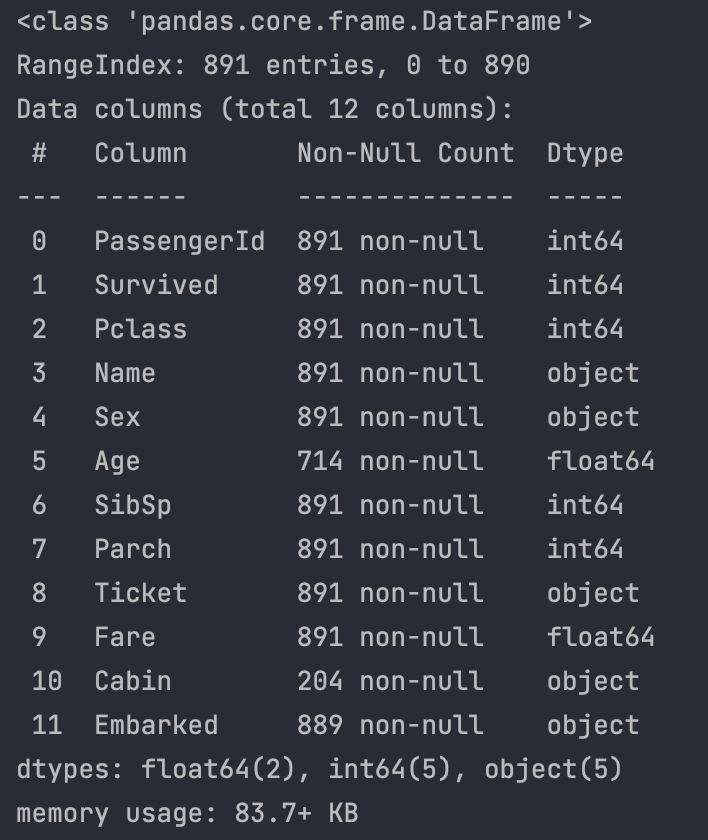
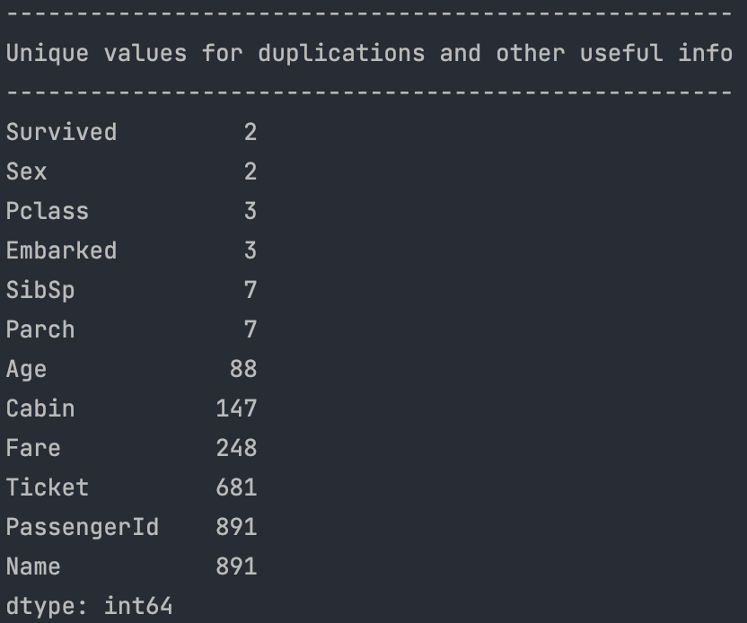
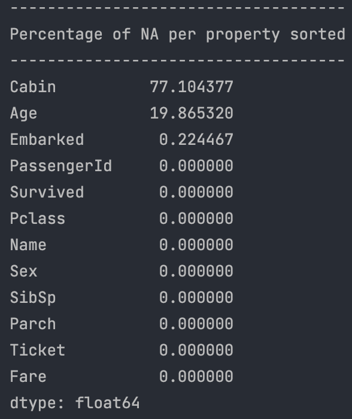

# Kaggle Titanic competition

## Data info

## How to clean the data
### Missing values:
* Cabin
* Age
* Embarked

### Categorical value
* Sex 
It has only two values, so I gonna convert it to 0 and 1.
* Name & Ticket 
They don't have any useful information, so I gonna drop it off. 
* Cabin
It could be useful if it doesn't drop such a many data. 77% of missing data is too much missing.
* 
